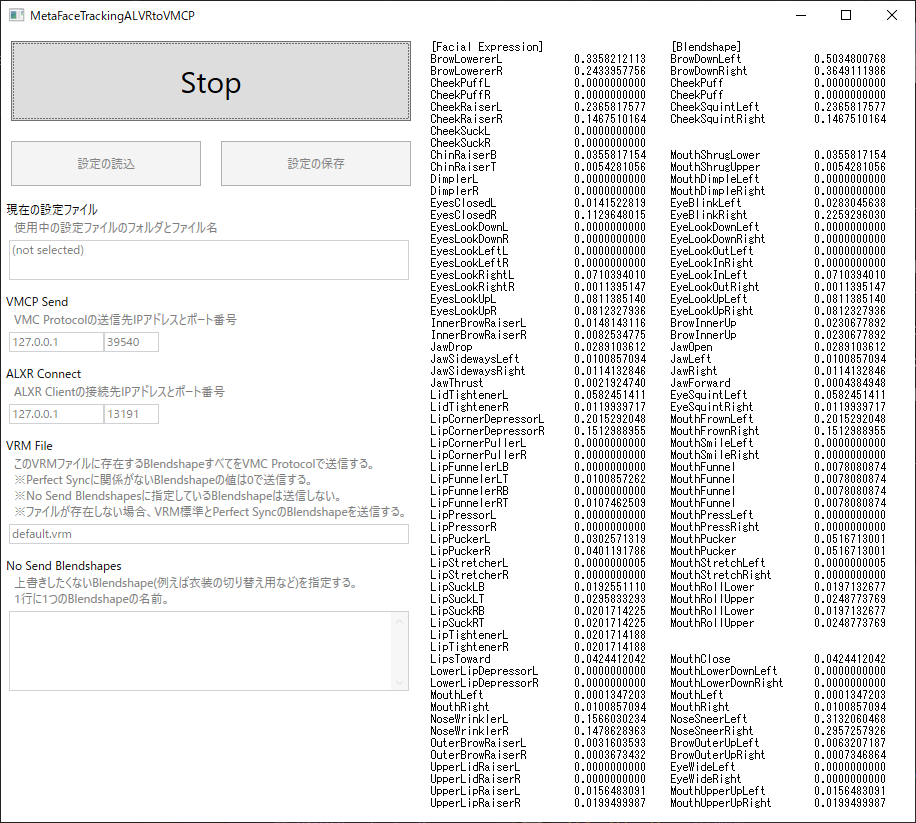

# MetaFaceTrackingALXRtoVMCP

alxr-client から Quest Pro の Face Tracking データを受け取り、そのデータを PerfectSync の Blendshape に変換して VMCProtocol で送信する Windows アプリです。

# 概要

本アプリは korejan さん (https://github.com/korejan) が開発している alxr-client を利用して動作します。

alxr-client は VRCFT (VRChatFaceTracking) Quest Pro 対応版を構成する複数アプリのうちの一つです。

VRCFT において Quest Pro の Face Tracking データは以下のような流れで VRChat に届きます。

Quest Pro --[Oculus(Air)Link]--> Oculusアプリ ----> alxr-client --[TCP]--> VRCFT --[OSC]--> VRChat

本アプリは VRCFT のかわりに alxr-client から Face Tracking データを受け取って VMCProtocol で VirtialMotionCapture などに送信します。

Quest Pro --[Oculus(Air)Link]--> Oculusアプリ ----> alxr-client --[TCP]--> 本アプリ --[VMCProtocol]--> VirtialMotionCapture

# 注意

本アプリは自分用に作っているため安定した動作を保証しません。

本アプリのみで機能が完結していないため様々な理由で「Quest Pro のフェイストラッキングを VMCProtocol & PerfectSync 対応アプリに反映させる」という目的が達成できなくなる可能性があります。

本アプリに関する質問を korejan さんに行わないでください。

本アプリ作者 sato の環境 i7-12700KF + RTX3070 で alxr-client と本アプリを動作させるとコントローラーのトラッキングに若干の遅延を感じました。 BeatSaber だと高難度のプレイに差し障りがありそうでした。

alxr-client を起動するだけで VR 内の操作に大きな影響が出るレベルでコントローラーのトラッキングが悪化する現象が発生することもありましたが具体的な条件は不明です。

# 環境構築

## Meta アカウント

1. Meta アカウントを Oculus 開発者アカウントにします。 https://developer.oculus.com/sign-up/ 

## MetaFaceTrackingALXRtoVMCP

1. .NET6.0のSDKまたはランタイムをインストールします。

2. https://github.com/tkns3/MetaFaceTrackingALXRtoVMCP/releases より MetaFaceTrackingALXRtoVMCP.exe をダウンロードします。

3. ダウンロードした MetaFaceTrackingALXRtoVMCP.exe を任意のフォルダに置きます。

## alxr-client

1. https://github.com/korejan/ALXR-experimental/releases より alxr-client-win-x64.zip をダウンロードします。

2. alxr-client-win-x64.zip を任意のフォルダに展開します。以降は D:\alxr-client-win-x64 に展開したものとして説明します。

3. D:\alxr-client-win-x64\alxr_client_windows\alxr-client.exe へのショートカットを作成します。

4. 作成したショートカットを右クリックしプロパティを選択します。プロパティのリンク先の末尾に ` --no-alvr-server --no-bindings` (先頭に半角空白があることに注意) を付け加えます。

## Quest Pro

1. アイトラッキング、フェイストラッキングを有効にしてください。

## Meta Quest アプリ (スマフォ)

1. ヘッドセットの設定で開発者モードを ON に設定します。

## Oculus アプリ

1. 設定の一般タブで「提供不明アプリ」の許可と「OpenXRランタイム」を Oculus に設定します。

2. 設定のベータタブで「開発者ランタイム機能」「Oculus Link経由でのアイトラッキング」「Oculus Link経由での自然な表情機能」をオンにします。

# 使い方

## 起動方法

1. Quest Pro を (Air)Link で接続します。

2. PC 上で alxr-client のショートカットを実行して alxr-client を起動します。 

3. PC 上で SteamVR を起動します。

4. PC 上で MetaFaceTrackingALXRtoVMCP を起動します。

5. PC 上で VirtualMotionCapture を起動します。

6. PC 上で VirtualMotionCapture で VRM を読み込みキャリブレーションします。

7. PC 上で「MetaFaceTrackingALXRtoVMCP の VMCP Send のポート番号」と「VirtualMotionCapture の モーション受信(VMCProtocol) のポート番号」が一致するように設定を変更します。

8. PC 上で VirtualMotionCapture の モーション受信(VMCProtocol)を有効にします。

9. PC 上で MetaFaceTrackingALXRtoVMCP の Start をクリックします。

※ PC 上のアプリ起動や操作は VR 内で Oculus や SteamVR のダッシュボードからデスクトップを表示してアプリ起動や操作を行っても大丈夫です。

## MetaFaceTrackingALXRtoVMCP の設定

気が向いたらかくかもしれない。

# 使用OSS、アプリ

## alxr-client
- https://github.com/korejan/ALVR/tree/facial-eye-tracking
- 開発者: korejan
- ライセンス: MIT License

## uOSC
- https://github.com/hecomi/uOSC
- 開発者: hecomi
- ライセンス: MIT license
- 備考: 参考に一部実装をコピー

